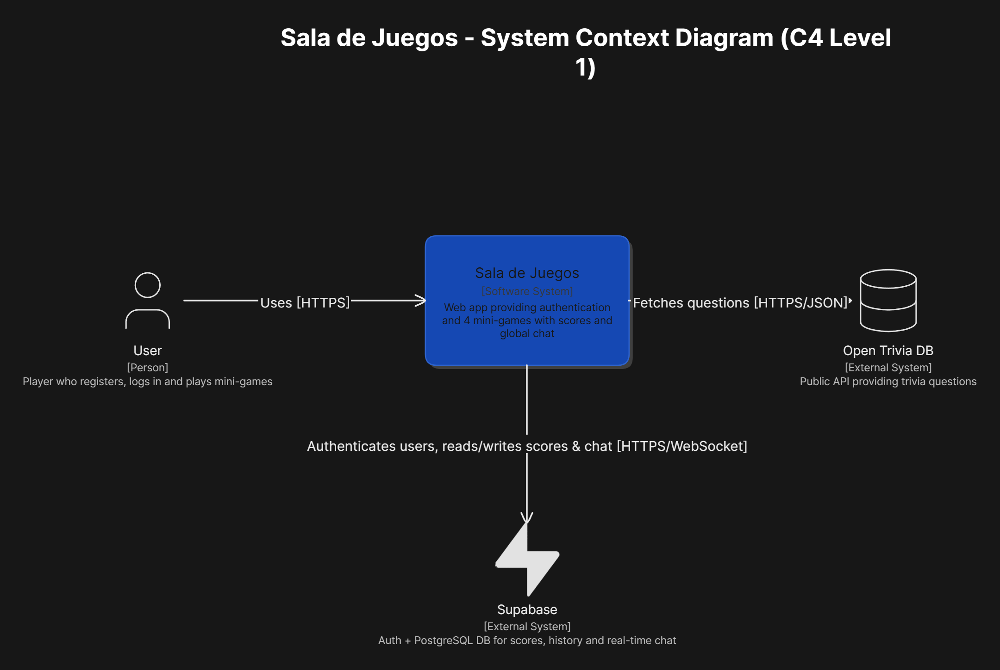
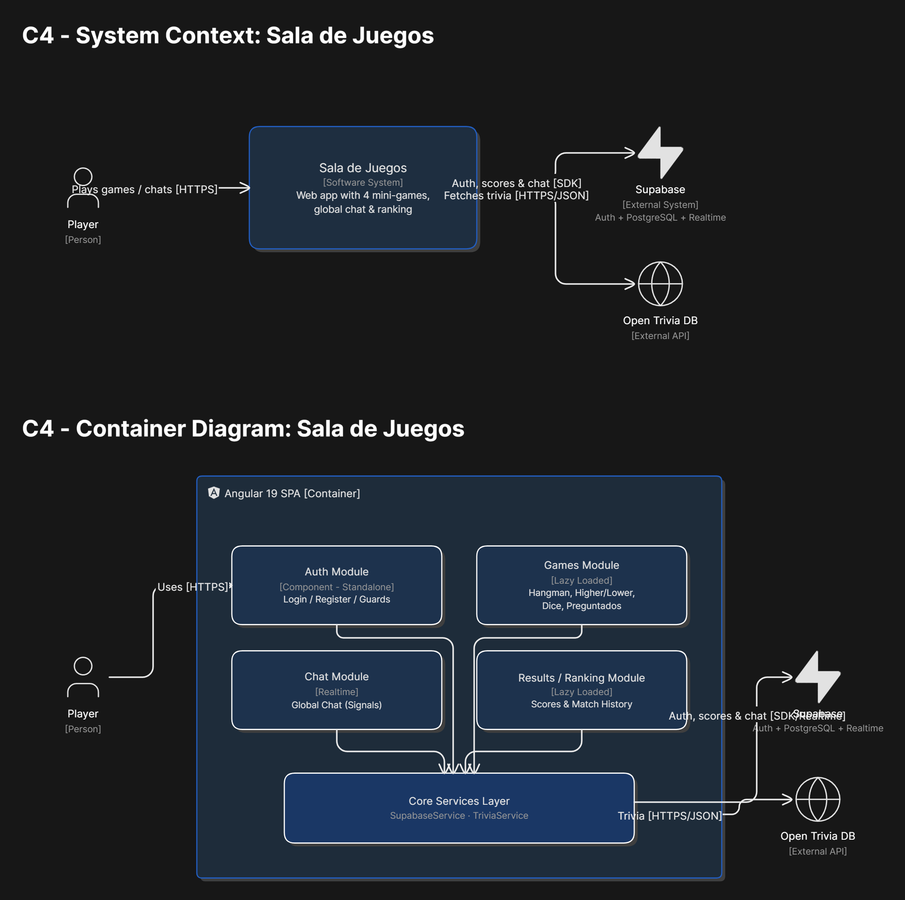

# Sala de Juegos

🌍 **Sitio web en vivo (Azure Static Web Apps):** [https://orange-ground-0b3278710.7.azurestaticapps.net](https://orange-ground-0b3278710.7.azurestaticapps.net/)

This project was generated with [Angular CLI](https://github.com/angular/angular-cli) version 17.3.17.

## Development server

Run `ng serve` for a dev server. Navigate to `http://localhost:4200/`. The application will automatically reload if you change any of the source files.

## Code scaffolding

Run `ng generate component component-name` to generate a new component. You can also use `ng generate directive|pipe|service|class|guard|interface|enum|module`.

## Build

Run `ng build` to build the project. The build artifacts will be stored in the `dist/` directory.

## Running unit tests

Run `ng test` to execute the unit tests via [Karma](https://karma-runner.github.io).

## Running end-to-end tests

Run `ng e2e` to execute the end-to-end tests via a platform of your choice. To use this command, you need to first add a package that implements end-to-end testing capabilities.

## Further help

To get more help on the Angular CLI use `ng help` or go check out the [Angular CLI Overview and Command Reference](https://angular.io/cli) page.

---

## 🏗️ Arquitectura y Documentación

Este proyecto ha sido diseñado siguiendo buenas prácticas de ingeniería de software. Puedes encontrar documentación técnica detallada sobre las decisiones clave tomadas durante el desarrollo (ADRs) y los diagramas de arquitectura en la carpeta `/docs`.

### Diagrama de Arquitectura (C4 Model)

*(Exporta ambos diagramas desde Eraser.io en formato PNG y guárdalos en la carpeta `docs/diagrams/` con los nombres indicados abajo)*

#### Nivel 1: Diagrama de Contexto

#### Nivel 4: Diagrama de Código / Componentes

### Registros de Decisiones Arquitectónicas (ADR)

Para mantener un registro claro del "por qué" detrás de las tecnologías y patrones utilizados, mantenemos los siguientes ADRs en `docs/adr/`:

* **`0001`**: [Arquitectura Frontend: Angular 19, Standalone Components y Lazy Loading](docs/adr/0001-arquitectura-frontend-angular-signals.md)
* **`0002`**: [Separación de Backend: Firebase Auth y Supabase](docs/adr/0002-backend-supabase-firebase.md)
* **`0003`**: [Componente Genérico para Tablas de Resultados](docs/adr/0003-componente-reutilizable-tabla-resultados.md)
* **`0004`**: [Juego: Ahorcado (Estado Local)](docs/adr/0004-juego-ahorcado.md)
* **`0005`**: [Juego: Mayor o Menor (Generación In-Memory)](docs/adr/0005-juego-mayor-menor.md)
* **`0006`**: [Juego: Dados (Simulación y UI)](docs/adr/0006-juego-dados.md)
* **`0007`**: [Juego: Preguntados (Integración Open Trivia DB)](docs/adr/0007-juego-preguntados.md)
